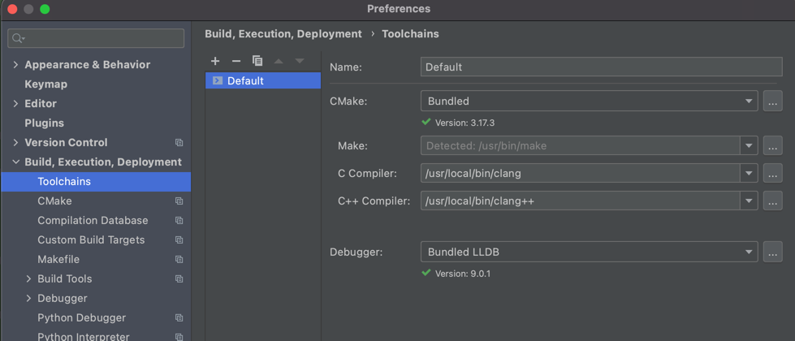

<!-- START doctoc generated TOC please keep comment here to allow auto update -->
<!-- DON'T EDIT THIS SECTION, INSTEAD RE-RUN doctoc TO UPDATE -->
<details>
<summary>Table of Contents</summary>

- [Modern C++: Snippets and Examples](#modern-c-snippets-and-examples)
  - [Quick Start](#quick-start)
  - [Data types](#data-types)
    - [Fundamental Data Types](#fundamental-data-types)
    - [Auto](#auto)
    - [Constants](#constants)
    - [Arrays](#arrays)
    - [Raw arrays](#raw-arrays)
    - [Vectors](#vectors)
    - [Strings](#strings)
    - [Raw Pointers](#raw-pointers)
    - [Smart pointers](#smart-pointers)
    - [Move](#move)
    - [Aggregate initialization](#aggregate-initialization)
    - [Structured binding](#structured-binding)
  - [Control flow](#control-flow)
    - [Hello World](#hello-world)
    - [Sequential](#sequential)
    - [Input](#input)
    - [Output](#output)
    - [Format](#format)
    - [Operators](#operators)
    - [Conditional](#conditional)
    - [Loops](#loops)
  - [Functions](#functions)
    - [Functions](#functions-1)
    - [Lambda](#lambda)
  - [Files](#files)
    - [File streams](#file-streams)
    - [Filesystem](#filesystem)
  - [Templates](#templates)
    - [Template functions](#template-functions)
    - [Template aliases](#template-aliases)
    - [Concepts](#concepts)
    - [SFINAE](#sfinae)
  - [Date and time](#date-and-time)
    - [Clock](#clock)
    - [Datetime](#datetime)
  - [Random](#random)
    - [Random](#random-1)
  - [Algorithm](#algorithm)
    - [Basic Algorithms](#basic-algorithms)
    - [Ranges](#ranges)
    - [Sorting](#sorting)
    - [Searching](#searching)
  - [Data structures](#data-structures)
    - [Sequential Containers](#sequential-containers)
    - [Associative Containers](#associative-containers)
    - [Tuples](#tuples)
    - [Memory resources](#memory-resources)
    - [Any](#any)
    - [Optional](#optional)
    - [Variant](#variant)
    - [Span](#span)
    - [Bitset](#bitset)
  - [Paradigms](#paradigms)
    - [Polymorphism cast](#polymorphism-cast)
    - [CRTP](#crtp)
    - [SFINAE](#sfinae-1)
    - [Polymorphism](#polymorphism)
    - [Metaprogramming](#metaprogramming)
  - [Parallel](#parallel)
    - [Threads](#threads)
    - [Executors](#executors)
    - [Timers](#timers)
    - [Signals](#signals)
    - [Async++](#async)
  - [Networking](#networking)
    - [Network](#network)
    - [Async Network](#async-network)
    - [Http server](#http-server)
  - [Utilities](#utilities)
    - [Regex](#regex)
  - [GUI](#gui)
    - [Qt](#qt)
    - [OpenGL + SDL](#opengl--sdl)
    - [OpenGL + GLFW](#opengl--glfw)
    - [IMGUI](#imgui)
    - [Webview](#webview)
    - [System tray](#system-tray)
  - [Tests](#tests)
    - [boost.ut](#boostut)
    - [Catch2](#catch2)
    - [Source Location](#source-location)
    - [Plots](#plots)
  - [Installing C++20](#installing-c20)
    - [Linux](#linux)
    - [Mac OS](#mac-os)
    - [Windows](#windows)

</details>
<!-- END doctoc generated TOC please keep comment here to allow auto update -->

# Modern C++: Snippets and Examples

We often need to copy and paste some snippets to code more productively. Snippets can help us when it's not easy to
remember all high levels features Modern C++ has to offer. This repository contains lots of organized, reusable, and
safe snippets for Modern C++. All snippets are available in GitHub pages in a way convenient for copying and pasting.

## Quick Start

This is how this repository works:

* The `snippets` directory has lots of short programs with useful C++20 snippets
* The `examples` directory has lots of short tasks using these snippets
* GitHub actions ensures all snippets are working on GCC, MSVC, and Clang
* We generate GitHub pages with all snippets by groups of tasks

**External Libraries**

For external libraries, we also include a short CMake snippet in the build script with:

* `find_package` to find, setup, and link the large external libraries
* `FetchContents` to download, build, and link the external library

We give preference for external libraries in this order:

1) Libraries that supported by all C++ compilers in the build workflow
1) Libraries that have been accepted into the C++ standard
3) Libraries likely to be accepted into C++23
4) Libraries representative of existing practice

**GitHub Pages**

We generate GitHub pages with all snippets:

* The GitHub pages are generated with mkdocs material and mdsplit
* Snippets organized in sections by groups of tasks
* Sections are easy to explore, copy, and paste

## Data types

### Fundamental Data Types

```cpp
                                           
```

### Auto

```cpp
                                     
```

### Constants

```cpp
                                          
```

### Raw arrays

```cpp
                                           
```

### Arrays

```cpp
                                       
```

### Vectors

```cpp
                                        
```

### Strings

```cpp
                                        
```

### Raw Pointers

```cpp
                                             
```

### Smart pointers

```cpp
                                               
```

### Move

```cpp
                                     
```

### Aggregate initialization

```cpp
                                                         
```

### Structured binding

```cpp
                                                   
```

## Control flow

### Hello World

```cpp
                                              
```

### Sequential

```cpp
                                             
```

### Input

```cpp
                                      
```

### Output

```cpp
                                           
```

### Format

```cpp
                                         
```

### Operators

```cpp
                                            
```

### Conditional

```cpp
                                              
```

### Loops

```cpp
                                        
```

## Functions

### Function

```cpp
                                         
```

### Lambda

```cpp
                                      
```

## Files

### File streams

```cpp
                                 
```

### Filesystem

```cpp
                                      
```

## Template

### Template function

```cpp
                                                  
```

### Template aliases

```cpp
                                              
```

### Concepts

```cpp
                                        
```

### SFINAE

```cpp
                                      
```

## Date and time

### Clock

```cpp
                                    
```

### Datetime

```cpp
                                       
```

## Random

### Random

```cpp
                                   
```

## Algorithm

### Basic Algorithms

```cpp
                                          
```

### Ranges

```cpp
                                      
```

### Sorting

```cpp
                                       
```

### Searching

```cpp
                                         
```

## Data structures

### Sequential Containers

```cpp
                                                           
```

### Associative Containers

```cpp
                                                            
```

### Memory resources

```cpp
                                                     
```

### Tuples

```cpp
                                            
```

### Any

```cpp
                                         
```

### Optional

```cpp
                                              
```

### Variant

```cpp
                                             
```

### Span

```cpp
                                          
```

### Bitset

```cpp
                                            
```

## Paradigms

### Polymorphism

```cpp
                                            
```

### Shared from this

```cpp
                                                
```

### Metaprogramming

```cpp
                                               
```

### CRTP

```cpp
                                    
```

### SFINAE

```cpp
                                      
```

## Parallel

### Threads

```cpp
                                             
```

### Executors

```cpp
                                        
```

### Timers

```cpp
                                     
```

### Signals

```cpp
                                      
```

### Async++

```cpp
                                          
```

## Networking

### Network

```cpp
                                        
```

### Async Network

```cpp
                                              
```

### Http server

main.cpp

```cpp
                                            
```

server.hpp

```cpp
                                              
```

connection_manager.hpp

```cpp
                                                          
```

connection.hpp

```cpp
                                                  
```

header.hpp

```cpp
                                              
```

reply.hpp

```cpp
                                             
```

request.hpp

```cpp
                                               
```

request_parser.hpp

```cpp
                                                      
```

mime_types.hpp

```cpp
                                                  
```

request_handler.hpp

```cpp
                                                       
```

mime_types.cpp

```cpp
                                                  
```

request_parser.cpp

```cpp
                                                      
```

reply.cpp

```cpp
                                             
```

request_handler.cpp

```cpp
                                                       
```

connection.cpp

```cpp
                                                  
```

connection_manager.cpp

```cpp
                                                          
```

server.cpp

```cpp
                                              
```

## Utilities

### Regex

```cpp
                                     
```

## GUI

### Qt

```cpp
                                     
```

### OpenGL + SDL

```cpp
                                              
```

### OpenGL + GLFW

```cpp
                                                  
```

### IMGUI

```cpp
                                           
```

### Webview

```cpp
                                               
```

### System tray

```cpp
                                         
```

## Tests

### Catch2

```cpp
                                            
```

### boost.ut

```cpp
                                         
```

### Source Location

```cpp
                                           
```

### Plots

```cpp
                                 
```

## Installing C++20

Many operating systems don't use C++20 by default yet. Follow these instructions to install C++20.

### Linux

Update GCC:

```bash
sudo apt install build-essential
sudo add-apt-repository ppa:ubuntu-toolchain-r/test
sudo apt-get update
sudo apt install gcc-10
sudo apt install g++-10
sudo update-alternatives --install /usr/bin/gcc gcc /usr/bin/gcc-10 10
sudo update-alternatives --install /usr/bin/g++ g++ /usr/bin/g++-10 10
```

Set your default compiler with:

```bash
update-alternatives --config g++
```

### Mac OS

Download a [recent version](https://releases.llvm.org/download.html) of Clang.

```bash
curl --output clang.tar.xz -L https://github.com/llvm/llvm-project/releases/download/llvmorg-11.0.0/clang+llvm-11.0.0-x86_64-apple-darwin.tar.xz
mkdir clang
tar -xvJf clang.tar.xz -C clang
```

Copy the files to `usr/local/`:

```bash
cd clang/clang+llvm-11.0.0-x86_64-apple-darwin
sudo cp -R * /usr/local/
```

Let CMake know that's the compiler you want to use.

If you want this to be your default compiler, you can set the `CXX` environment variable:

```bash
export CXX=/usr/local/bin/clang++
```

If you want to use this compiler in a single project, run CMake with these options:

```bash
-DCMAKE_C_COMPILER=/usr/local/bin/clang -DCMAKE_CXX_COMPILER=/usr/local/bin/clang++
```

Or tell you IDE to pass these options to CMake:



### Windows

Update your [Visual Studio](https://visualstudio.microsoft.com) Compiler.

The most recent version of Visual Studio should include C++20.

!!! warning We still don't know of a script for installing C++20 on Windows from the terminal.