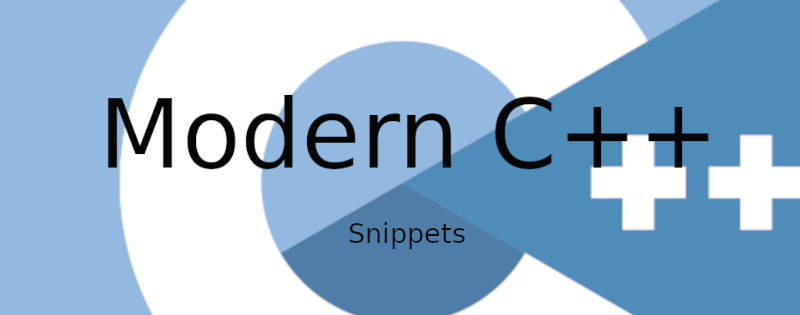

# Modern C++: Snippets and Examples

> GitHub Pages with snippets for Modern C++

<!-- START mdsplit-ignore -->
[](https://alandefreitas.github.io/moderncpp/)
<!-- END mdsplit-ignore -->

<br/>

* We often need to copy and paste some snippets to code more productively. 
* Snippets can help us when it's not easy to remember all high levels features Modern C++ has to offer. 
* This repository contains lots of organized, reusable, and safe snippets for Modern C++.
* All snippets are available in [GitHub pages](https://alandefreitas.github.io/moderncpp/) in a convenient way for copying and pasting.

<br/>

<!-- START mdsplit-ignore -->

<h2>

[EXPLORE THE SNIPPETS HERE](https://alandefreitas.github.io/moderncpp/)

</h2>

<!-- END mdsplit-ignore -->

<br/>

<!-- https://github.com/bradvin/social-share-urls -->
[](https://www.facebook.com/sharer/sharer.php?t=ModernCpp%20Snippets%20and%20Examples&u=https://github.com/alandefreitas/moderncpp/)
[](http://sns.qzone.qq.com/cgi-bin/qzshare/cgi_qzshare_onekey?url=https://github.com/alandefreitas/moderncpp/&title=ModernCpp%20Snippets%20and%20Examples&summary=ModernCpp%20Snippets%20and%20Examples)
[](http://sns.qzone.qq.com/cgi-bin/qzshare/cgi_qzshare_onekey?url=https://github.com/alandefreitas/moderncpp/&title=ModernCpp%20Snippets%20and%20Examples&summary=ModernCpp%20Snippets%20and%20Examples)
[](http://www.reddit.com/submit?url=https://github.com/alandefreitas/moderncpp/&title=ModernCpp%20Snippets%20and%20Examples)
[](https://twitter.com/intent/tweet?text=ModernCpp%20Snippets%20and%20Examples&url=https://github.com/alandefreitas/moderncpp/&hashtags=Cpp,Snippets,ModernCpp,ScientificComputing,Examples,Developers)
[](https://www.linkedin.com/shareArticle?mini=false&url=https://github.com/alandefreitas/moderncpp/&title=ModernCpp%20Snippets%20and%20Examples)
[](https://api.whatsapp.com/send?text=ModernCpp%20Snippets%20and%20Examples:+https://github.com/alandefreitas/moderncpp/)
[](https://lineit.line.me/share/ui?url=https://github.com/alandefreitas/moderncpp/&text=ModernCpp%20Snippets%20and%20Examples)
[](https://telegram.me/share/url?url=https://github.com/alandefreitas/moderncpp/&text=ModernCpp%20Snippets%20and%20Examples)
[](https://news.ycombinator.com/submitlink?u=https://github.com/alandefreitas/moderncpp/&t=ModernCpp%20Snippets%20and%20Examples)

<br/>


<!-- START doctoc generated TOC please keep comment here to allow auto update -->
<!-- DON'T EDIT THIS SECTION, INSTEAD RE-RUN doctoc TO UPDATE -->
<details>
<summary>Table of Contents</summary>

- [Quick Start](#quick-start)
- [Data types](#data-types)
  - [Build script](#build-script)
  - [Fundamental Data Types](#fundamental-data-types)
  - [Auto](#auto)
  - [Constants](#constants)
  - [Raw arrays](#raw-arrays)
  - [Arrays](#arrays)
  - [Vectors](#vectors)
  - [Strings](#strings)
  - [Raw Pointers](#raw-pointers)
  - [Smart pointers](#smart-pointers)
  - [Move](#move)
  - [Aggregate initialization](#aggregate-initialization)
  - [Structured binding](#structured-binding)
- [Control flow](#control-flow)
  - [Build script](#build-script-1)
  - [Hello World](#hello-world)
  - [Sequential](#sequential)
  - [Input](#input)
  - [Output](#output)
  - [Format](#format)
  - [Operators](#operators)
  - [Conditional](#conditional)
  - [Loops](#loops)
- [Functions](#functions)
  - [Build script](#build-script-2)
  - [Function](#function)
  - [Lambda](#lambda)
- [Files](#files)
  - [Build script](#build-script-3)
  - [File streams](#file-streams)
  - [Filesystem](#filesystem)
- [Template](#template)
  - [Build script](#build-script-4)
  - [Template function](#template-function)
  - [Template aliases](#template-aliases)
  - [Concepts](#concepts)
  - [SFINAE](#sfinae)
- [Date and time](#date-and-time)
  - [Build script](#build-script-5)
  - [Clock](#clock)
  - [Datetime](#datetime)
- [Random](#random)
  - [Build script](#build-script-6)
  - [Random](#random-1)
  - [PCG](#pcg)
- [Algorithm](#algorithm)
  - [Build script](#build-script-7)
  - [Searching](#searching)
  - [Sorting](#sorting)
  - [Basic Algorithms](#basic-algorithms)
  - [Ranges](#ranges)
- [Data structures](#data-structures)
  - [Build script](#build-script-8)
  - [Sequential Containers](#sequential-containers)
  - [Associative Containers](#associative-containers)
  - [Memory resource](#memory-resource)
  - [Tuples](#tuples)
  - [Any](#any)
  - [Optional](#optional)
  - [Variant](#variant)
  - [Span](#span)
  - [Bitset](#bitset)
  - [Spatial Containers](#spatial-containers)
- [Paradigms](#paradigms)
  - [Build script](#build-script-9)
  - [Polymorphism](#polymorphism)
  - [Shared from this](#shared-from-this)
  - [Metaprogramming](#metaprogramming)
  - [CRTP](#crtp)
  - [SFINAE](#sfinae-1)
- [Parallel](#parallel)
  - [Build script](#build-script-10)
  - [Execution Policies](#execution-policies)
  - [Threads](#threads)
  - [Executors](#executors)
  - [Timers](#timers)
  - [Signals](#signals)
  - [Async++](#async)
- [Networking](#networking)
  - [Build script](#build-script-11)
  - [Network](#network)
  - [Async Network](#async-network)
  - [Http server](#http-server)
- [Utilities](#utilities)
  - [Build script](#build-script-12)
  - [Regex](#regex)
- [GUI](#gui)
  - [Build script](#build-script-13)
  - [Qt](#qt)
  - [OpenGL + SDL](#opengl--sdl)
  - [OpenGL + GLFW](#opengl--glfw)
  - [IMGUI](#imgui)
  - [Webview](#webview)
  - [System tray](#system-tray)
- [Tests](#tests)
  - [Build script](#build-script-14)
  - [Catch2](#catch2)
  - [boost.ut](#boostut)
  - [Source Location](#source-location)
  - [Plots](#plots)
- [CMake functions](#cmake-functions)
- [Installing a C++20 compiler](#installing-a-c20-compiler)
  - [Linux](#linux)
  - [Mac OS](#mac-os)
  - [Windows](#windows)
- [FAQ](#faq)
- [Get involved](#get-involved)

</details>
<!-- END doctoc generated TOC please keep comment here to allow auto update -->

## Quick Start

This is how this repository works:

* The [`snippets`](./snippets/CMakeLists.txt) directory has lots of short programs with useful C++20 snippets
* The [`examples`](./examples/CMakeLists.txt) directory has lots of short tasks using these snippets
* [GitHub actions](https://github.com/alandefreitas/moderncpp/actions?query=workflow%3ABuild) ensures all snippets are working on GCC, MSVC, and Clang
* We generate GitHub pages with all snippets by groups of tasks using [mkdocs material](https://squidfunk.github.io/mkdocs-material/) and [mdsplit](https://alandefreitas.github.io/mdsplit/)

<br/>

**Libraries**

We give preference to libraries in this order:

1. Libraries [supported](https://en.cppreference.com/w/cpp/compiler_support) by most C++ compilers
2. Libraries [accepted](https://timsong-cpp.github.io/cppwp/n4861/) into the C++ standard
3. Libraries [likely to be accepted](https://eel.is/c++draft/) into the next C++ standard
4. Libraries representative of existing practice

<br/>

**External Libraries**

For external libraries, we also include a short CMake snippet in the build script with:

* [`find_package`](https://cmake.org/cmake/help/latest/command/find_package.html) to find, setup, and link the large external libraries
* [`FetchContents`](https://cmake.org/cmake/help/latest/module/FetchContent.html) to download, build, and link the external library

<br/>

**Snippets and Examples**

The snippets, as they are, might seem like they are examples in the sense that they are in long files sometimes. What makes them snippets is that, at the source file level, they represent lots of independent short tasks separated by comments. Unlike in the examples, the tasks separated by comments are unrelated. You can just copy and paste the snippets between pairs of comments.

<br/>

**GitHub Pages**

We generate GitHub pages with all snippets:

* The GitHub pages are generated with [mkdocs material](https://squidfunk.github.io/mkdocs-material/) and [mdsplit](https://alandefreitas.github.io/mdsplit/)
* Snippets organized are categorized by groups of tasks
* Sections are easy to explore, copy, and paste

## Data types

### Build script

```cmake
--8<-- "snippets/data_types/CMakeLists.txt"
```

### Fundamental Data Types

```cpp
--8<-- "snippets/data_types/data_types.cpp"
```

### Auto

```cpp
--8<-- "snippets/data_types/auto.cpp"
```

### Constants

```cpp
--8<-- "snippets/data_types/constants.cpp"
```

### Raw arrays

```cpp
--8<-- "snippets/data_types/raw_arrays.cpp"
```

### Arrays

```cpp
--8<-- "snippets/data_types/arrays.cpp"
```

### Vectors

```cpp
--8<-- "snippets/data_types/vectors.cpp"
```

### Strings

```cpp
--8<-- "snippets/data_types/strings.cpp"
```

### Raw Pointers

```cpp
--8<-- "snippets/data_types/raw_pointers.cpp"
```

### Smart pointers

```cpp
--8<-- "snippets/data_types/smart_pointers.cpp"
```

### Move

```cpp
--8<-- "snippets/data_types/move.cpp"
```

### Aggregate initialization

```cpp
--8<-- "snippets/data_types/aggregate_initialization.cpp"
```

### Structured binding

```cpp
--8<-- "snippets/data_types/structured_binding.cpp"
```

## Control flow

### Build script

```cmake
--8<-- "snippets/control_flow/CMakeLists.txt"
```

### Hello World

```cpp
--8<-- "snippets/control_flow/hello_world.cpp"
```

### Sequential

```cpp
--8<-- "snippets/control_flow/sequential.cpp"
```

### Input

```cpp
--8<-- "snippets/control_flow/cin.cpp"
```

### Output

```cpp
--8<-- "snippets/control_flow/printing.cpp"
```

### Format

```cpp
--8<-- "snippets/control_flow/format.cpp"
```

### Operators

```cpp
--8<-- "snippets/control_flow/operators.cpp"
```

### Conditional

```cpp
--8<-- "snippets/control_flow/conditional.cpp"
```

### Loops

```cpp
--8<-- "snippets/control_flow/loops.cpp"
```

## Functions

### Build script

```cmake
--8<-- "snippets/functions/CMakeLists.txt"
```

### Function

```cpp
--8<-- "snippets/functions/functions.cpp"
```

### Lambda

```cpp
--8<-- "snippets/functions/lambda.cpp"
```

## Files

### Build script

```cmake
--8<-- "snippets/files/CMakeLists.txt"
```

FindFilesystem.cmake:

```cmake
--8<-- "cmake/FindFilesystem.cmake"
```

### File streams

```cpp
--8<-- "snippets/files/files.cpp"
```

### Filesystem

```cpp
--8<-- "snippets/files/filesystem.cpp"
```

## Template

### Build script

```cmake
--8<-- "snippets/templates/CMakeLists.txt"
```

### Template function

```cpp
--8<-- "snippets/templates/template_functions.cpp"
```

### Template aliases

```cpp
--8<-- "snippets/templates/template_alias.cpp"
```

### Concepts

```cpp
--8<-- "snippets/templates/concepts.cpp"
```

FindConcepts.cmake:

```cmake
--8<-- "cmake/FindConcepts.cmake"
```

### SFINAE

```cpp
--8<-- "snippets/templates/sfinae.cpp"
```

## Date and time

### Build script

```cmake
--8<-- "snippets/datetime/CMakeLists.txt"
```

### Clock

```cpp
--8<-- "snippets/datetime/clock.cpp"
```

### Datetime

```cpp
--8<-- "snippets/datetime/datetime.cpp"
```

## Random

### Build script

```cmake
--8<-- "snippets/random/CMakeLists.txt"
```

### Random

```cpp
--8<-- "snippets/random/random.cpp"
```

### PCG

```cpp
--8<-- "snippets/random/pcg.cpp"
```

## Algorithm

### Build script

```cmake
--8<-- "snippets/algorithm/CMakeLists.txt"
```

### Searching

```cpp
--8<-- "snippets/algorithm/searching.cpp"
```

### Sorting

```cpp
--8<-- "snippets/algorithm/sorting.cpp"
```

### Basic Algorithms

```cpp
--8<-- "snippets/algorithm/algorithms.cpp"
```

### Ranges

```cpp
--8<-- "snippets/algorithm/ranges.cpp"
```

## Data structures

### Build script

```cmake
--8<-- "snippets/data_structures/CMakeLists.txt"
```

### Sequential Containers

```cpp
--8<-- "snippets/data_structures/sequential_containers.cpp"
```

### Associative Containers

```cpp
--8<-- "snippets/data_structures/associative_containers.cpp"
```

### Memory resource

```cpp
--8<-- "snippets/data_structures/memory_resource.cpp"
```

FindPMR.cmake:

```cmake
--8<-- "cmake/FindPMR.cmake"
```

### Tuples

```cpp
--8<-- "snippets/data_structures/tuples.cpp"
```

### Any

```cpp
--8<-- "snippets/data_structures/any.cpp"
```

### Optional

```cpp
--8<-- "snippets/data_structures/optional.cpp"
```

### Variant

```cpp
--8<-- "snippets/data_structures/variant.cpp"
```

### Span

```cpp
--8<-- "snippets/data_structures/span.cpp"
```

### Bitset

```cpp
--8<-- "snippets/data_structures/bitset.cpp"
```

### Spatial Containers

```cpp
--8<-- "snippets/data_structures/spatial_containers.cpp"
```

## Paradigms

### Build script

```cmake
--8<-- "snippets/paradigms/CMakeLists.txt"
```

### Polymorphism

```cpp
--8<-- "snippets/paradigms/polymorphism.cpp"
```

### Shared from this

```cpp
--8<-- "snippets/paradigms/shared_from_this.cpp"
```

### Metaprogramming

```cpp
--8<-- "snippets/paradigms/metaprogramming.cpp"
```

### CRTP

```cpp
--8<-- "snippets/paradigms/CRTP.cpp"
```

### SFINAE

```cpp
--8<-- "snippets/paradigms/SFINAE.cpp"
```

## Parallel

### Build script

```cmake
--8<-- "snippets/parallel/CMakeLists.txt"
```

### Execution Policies

```cpp
--8<-- "snippets/parallel/policies.cpp"
```

### Threads

```cpp
--8<-- "snippets/parallel/multithreading.cpp"
```

### Executors

```cpp
--8<-- "snippets/parallel/executors.cpp"
```

### Timers

```cpp
--8<-- "snippets/parallel/timers.cpp"
```

### Signals

```cpp
--8<-- "snippets/parallel/signals.cpp"
```

### Async++

```cpp
--8<-- "snippets/parallel/async_pools.cpp"
```

## Networking

### Build script

```cmake
--8<-- "snippets/networking/CMakeLists.txt"
```

### Network

```cpp
--8<-- "snippets/networking/network.cpp"
```

### Async Network

```cpp
--8<-- "snippets/networking/network_async.cpp"
```

### Http server

main.cpp

```cpp
--8<-- "snippets/networking/server/main.cpp"
```

server.hpp

```cpp
--8<-- "snippets/networking/server/server.hpp"
```

connection_manager.hpp

```cpp
--8<-- "snippets/networking/server/connection_manager.hpp"
```

connection.hpp

```cpp
--8<-- "snippets/networking/server/connection.hpp"
```

header.hpp

```cpp
--8<-- "snippets/networking/server/header.hpp"
```

reply.hpp

```cpp
--8<-- "snippets/networking/server/reply.hpp"
```

request.hpp

```cpp
--8<-- "snippets/networking/server/request.hpp"
```

request_parser.hpp

```cpp
--8<-- "snippets/networking/server/request_parser.hpp"
```

mime_types.hpp

```cpp
--8<-- "snippets/networking/server/mime_types.hpp"
```

request_handler.hpp

```cpp
--8<-- "snippets/networking/server/request_handler.hpp"
```

mime_types.cpp

```cpp
--8<-- "snippets/networking/server/mime_types.cpp"
```

request_parser.cpp

```cpp
--8<-- "snippets/networking/server/request_parser.cpp"
```

reply.cpp

```cpp
--8<-- "snippets/networking/server/reply.cpp"
```

request_handler.cpp

```cpp
--8<-- "snippets/networking/server/request_handler.cpp"
```

connection.cpp

```cpp
--8<-- "snippets/networking/server/connection.cpp"
```

connection_manager.cpp

```cpp
--8<-- "snippets/networking/server/connection_manager.cpp"
```

server.cpp

```cpp
--8<-- "snippets/networking/server/server.cpp"
```

## Utilities

### Build script

```cmake
--8<-- "snippets/utilities/CMakeLists.txt"
```

### Regex

```cpp
--8<-- "snippets/utilities/regex.cpp"
```

## GUI

### Build script

```cmake
--8<-- "snippets/gui/CMakeLists.txt"
```

### Qt

```cpp
--8<-- "snippets/gui/qt/qt_hello.cpp"
```

Build script: 

```cmake
--8<-- "snippets/gui/qt/CMakeLists.txt"
```

### OpenGL + SDL

```cpp
--8<-- "snippets/gui/opengl/sdl/sdl_hello.cpp"
```

Build script: 

```cmake
--8<-- "snippets/gui/opengl/sdl/CMakeLists.txt"
```

### OpenGL + GLFW

```cpp
--8<-- "snippets/gui/opengl/glfw/opengl_hello.cpp"
```

Build script: 

```cmake
--8<-- "snippets/gui/opengl/glfw/CMakeLists.txt"
```

### IMGUI

```cpp
--8<-- "snippets/gui/imgui/imgui_hello.cpp"
```

Build script: 

```cmake
--8<-- "snippets/gui/imgui/CMakeLists.txt"
```

### Webview

```cpp
--8<-- "snippets/gui/webview/webview_hello.cpp"
```

Build script: 

```cmake
--8<-- "snippets/gui/webview/CMakeLists.txt"
```

### System tray

```cpp
--8<-- "snippets/gui/tray/tray_hello.cpp"
```

Build script: 

```cmake
--8<-- "snippets/gui/tray/CMakeLists.txt"
```

## Tests

### Build script

```cmake
--8<-- "snippets/tests/CMakeLists.txt"
```

### Catch2

```cpp
--8<-- "snippets/tests/unit_tests_catch.cpp"
```

### boost.ut

```cpp
--8<-- "snippets/tests/unit_tests_ut.cpp"
```

### Source Location

```cpp
--8<-- "snippets/tests/source_location.cpp"
```

### Plots

```cpp
--8<-- "snippets/tests/plots.cpp"
```

## CMake functions

Some useful CMake functions:

```cmake
--8<-- "cmake/functions.cmake"
```

## Installing a C++20 compiler

Many operating systems don't come with C++20 by default. Follow these instructions to install C++20.

### Linux

Update GCC:

```bash
sudo apt install build-essential
sudo add-apt-repository ppa:ubuntu-toolchain-r/test
sudo apt-get update
sudo apt install gcc-10
sudo apt install g++-10
sudo update-alternatives --install /usr/bin/gcc gcc /usr/bin/gcc-10 10
sudo update-alternatives --install /usr/bin/g++ g++ /usr/bin/g++-10 10
```

Set your default compiler with:

```bash
update-alternatives --config g++
```

### Mac OS

Download a [recent version](https://releases.llvm.org/download.html) of Clang.

```bash
curl --output clang.tar.xz -L https://github.com/llvm/llvm-project/releases/download/llvmorg-11.0.0/clang+llvm-11.0.0-x86_64-apple-darwin.tar.xz
mkdir clang
tar -xvJf clang.tar.xz -C clang
```

Copy the files to `usr/local/`:

```bash
cd clang/clang+llvm-11.0.0-x86_64-apple-darwin
sudo cp -R * /usr/local/
```

Let CMake know that's the compiler you want to use.

If you want this to be your default compiler, you can set the `CXX` environment variable:

```bash
export CXX=/usr/local/bin/clang++
```

If you want to use this compiler in a single project, run CMake with these options:

```bash
-DCMAKE_C_COMPILER=/usr/local/bin/clang -DCMAKE_CXX_COMPILER=/usr/local/bin/clang++
```

Or tell you IDE to pass these options to CMake:


### Windows

Update your [Visual Studio](https://visualstudio.microsoft.com) Compiler.

The most recent version of Visual Studio should include C++20.

!!! warning 
    We still don't know of a script for installing C++20 on Windows from the terminal.

    This would be especially useful for our [build workflow](./.github/workflows/build.yml), which has not been testing MSVC since we moved to C++20.

    Please let us know or open a PR if you know of such a script.

## FAQ

**Where are the examples? Are the snippets examples?**

The complete examples are in the [`examples`](./examples) directory, but they not explicitly replicated in the docs because they are much longer than the snippets.

**What's the difference between snippets and examples?**

Examples are often long and don't represent independent tasks you can copy and paste. Snippets represent independent
tasks between pairs of comments that you can copy and paste.

**Shouldn't the snippet files be short files?**

The snippets could go into a new category level and we could separate them at their lowest level by file, but that would
make them difficult to explore if the resolution is too high, like 3-4 lines of code per file. Also, because snippets
have pre-conditions and post-conditions, it would make it much harder to test all snippets.

**Why not get my snippets directly from cppreference or cplusplus.com?**

The cppreference is not meant for snippets and this repository is not meant to be a reference for the C++ standard. Some
implications are:

* The snippets:
    * Meant to list the commands you most often need in a library.
    * Lots of independent tasks for copying and pasting
    * Include corresponding build scripts when something more complex is required
    * Include external libraries when it's existing practice
    * Organized roughly in the order someone learning C++ might need them
* The examples in cppreference or cplusplus.com:
    * Meant to make points about the internals of the libraries.
    * A single task meant to prove a point
    * Has nothing to do with build scripts
    * Has nothing to do with external libraries
    * Mix simple and complex concepts to make a point

**Why do you use `std::endl` in the snippets? Isn't it evil?**

The snippets usually use `std::endl` instead of `'\n'`:

* Flushing *does* have a [semantic meaning](https://en.cppreference.com/w/cpp/io/manip/flush) different from `'\n` which is a nice convention for small snippets (please show me what's in the buffer vs. put a newline in the buffer)
* Most snippets require creating variables first and using them later so that we can test the snippets with GitHub Actions. The flushing part is not what you are going to copy and paste in a snippet.
* The time difference of flushing `std::cout` to the console (not files!) is [negligible](./examples/datetime/flushtime.cpp)
* Almost no application is spending more time flushing than calculating things to flush. Unless it's a flushing benchmark.

## Get involved

* After getting started with this library, please complete this [survey](http://www.alandefreitas.com/survey/alandefreitas/moderncpp) to let us know how we can improve your experience.
* Discussions are concentrated on our GitHub [discussions](https://github.com/alandefreitas/moderncpp/discussions) page. Don't refrain from asking questions and proposing ideas.
* If you are a programmer with good ideas, please [share](https://github.com/alandefreitas/moderncpp/discussions/new) these ideas with us.
* Academic collaboration is more than welcome.

**Contributing**

Feel free to contribute with new snippets to this repository. For complex features and changes, consider [getting feedback](https://github.com/alandefreitas/moderncpp/discussions/new) from the community first.

There are many ways in which you can contribute to this library:

* Testing the library in new environments
* Contributing with interesting snippets and examples
* Finding problems in the documentation
* Finding bugs in general
* Whatever idea seems interesting to you

The only thing we ask you is to make sure your contribution is not destructive. Some contributions in which we are not interested are:

* "I don't like this optional feature so I removed/deprecated it"
* "I removed this feature to support older versions of C++" but have not provided an equivalent alternative. This repository is focused on Modern C++.
* "I removed this feature so I don't have to install/update ______" but have not provided an equivalent alternative
* "I'm creating this high-cost promise that we'll support ________ forever" but I'm not sticking around to keep that promise

In doubt, please open a [discussion](https://github.com/alandefreitas/moderncpp/discussions) first.

**Guidelines**

If contributing with code, please leave the pedantic mode ON (`-DBUILD_WITH_PEDANTIC_WARNINGS=ON`), use [cppcheck](http://cppcheck.sourceforge.net/), and [clang-format](https://clang.llvm.org/docs/ClangFormat.html).

<details>
    <summary>Example: CLion</summary>


</details>

If contributing to the documentation, please edit [`README.md`](README.md) directly, as the files in [`./docs`](docs)
are automatically generated with [mdsplit](https://github.com/alandefreitas/mdsplit).
